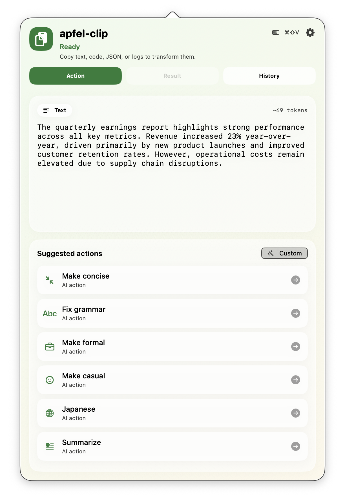
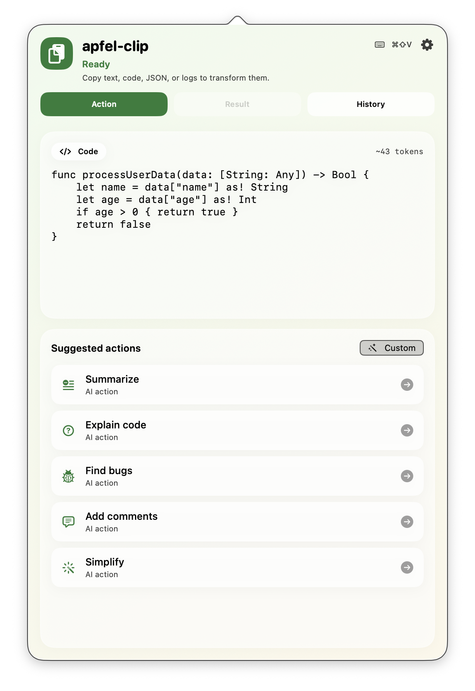
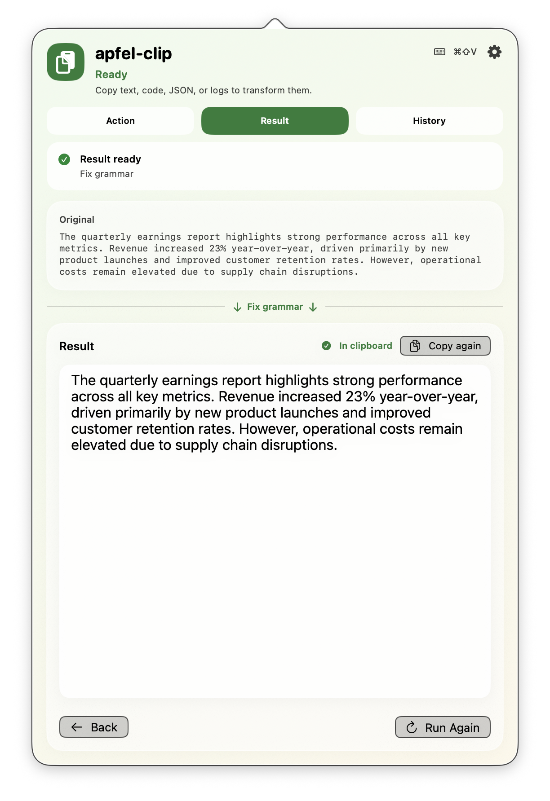
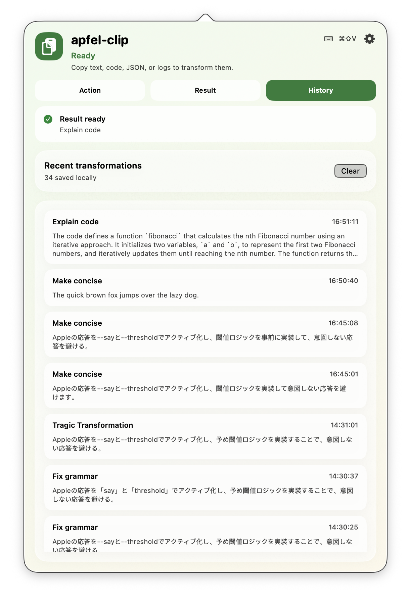

# apfel-clip

**AI clipboard actions for macOS — on-device, instant, private.**

Copy text, code, JSON, logs, or an error. Hit **⌘⇧V**. Pick an action. Paste the result. Everything runs locally via [apfel](https://github.com/Arthur-Ficial/apfel) — no API keys, no cloud, no data leaving your machine.

[](LICENSE)
[](https://www.apple.com/macos/)
[](https://www.apple.com/mac/)

---

## Screenshots

<table>
<tr>
<td align="center" width="50%">
<br>
<strong>Text actions</strong> — fix grammar, rewrite tone, summarise
</td>
<td align="center" width="50%">
<br>
<strong>Code actions</strong> — explain, find bugs, add comments
</td>
</tr>
<tr>
<td align="center" width="50%">
<br>
<strong>Result view</strong> — original → action → editable result
</td>
<td align="center" width="50%">
<br>
<strong>History</strong> — every successful transformation saved locally
</td>
</tr>
</table>

---

## What it does

apfel-clip detects what's in your clipboard and offers the right actions for it:

| Content type | Actions |
|---|---|
| **Text / prose** | Fix grammar, make formal, make casual, translate, summarise, bullet points, make concise |
| **Code** | Explain code, find bugs, add comments, simplify |
| **Error messages** | Explain error, suggest fix |
| **Shell commands** | Explain command, make safer |
| **JSON** | Explain structure, pretty format |
| **Any** | Custom prompt — your own instruction, or save it as a named action |

## Features

- **Fully on-device** — Apple Intelligence via apfel, no network calls
- **Smart content detection** — right actions appear automatically
- **Global hotkey ⌘⇧V** — works from any app
- **Save custom actions** — turn any prompt into a reusable named action with an icon
- **Favourites & reorder** — star, hide, drag to sort your action list
- **Persistent history** — re-copy or revisit past results
- **Auto-copy** — result lands in clipboard the instant the model finishes

---

## Requirements

- macOS 26 (Tahoe) or later
- Apple Silicon (M1 or later)
- Apple Intelligence enabled
- [`apfel`](https://github.com/Arthur-Ficial/apfel) — embedded in packaged builds, or on `PATH` for source builds

---

## Install

### One-liner (recommended)

```bash
curl -fsSL https://raw.githubusercontent.com/Arthur-Ficial/apfel-clip/main/scripts/install.sh | bash
```

Installs `apfel-clip.app` into `/Applications` and links `apfel-clip` into `~/.local/bin`.

### Direct download

Download the latest zip from [Releases](https://github.com/Arthur-Ficial/apfel-clip/releases/latest), unzip, and drag `apfel-clip.app` to `/Applications`.

```bash
# Verify checksum (SHA256SUMS is in each release)
shasum -a 256 apfel-clip-macos-arm64.zip
```

### Homebrew

```bash
brew tap Arthur-Ficial/tap
brew install --cask apfel-clip
```

### Build from source

```bash
git clone https://github.com/Arthur-Ficial/apfel-clip.git
cd apfel-clip
make install
```

> **First launch:** macOS may show a Gatekeeper warning for unsigned apps. Right-click the app → **Open** to bypass it once.

---

## Usage

1. Copy any text, code, or error to your clipboard
2. Press **⌘⇧V** (or click the clipboard icon in the menu bar)
3. Pick an action from the list
4. The result appears in the Result tab — edit if needed, then copy

### Custom prompts

Hit **Custom** in the action list to write any free-form instruction. After running it, tap **Save as Action** to add it to your personal action list with a name and icon.

### Control API

apfel-clip exposes a local HTTP API for automation:

```bash
# Run an action programmatically
curl -X POST http://localhost:11436/run \
  -H "Content-Type: application/json" \
  -d '{"action_id": "fix-grammar"}'

# Check status
curl http://localhost:11436/health
```

---

## Architecture

```
App/ApfelClipApp.swift  →  App/AppDelegate.swift
  ├─ Services/ServerManager            — spawns apfel --serve --port 11435
  ├─ Services/PasteboardClipboardService — polls NSPasteboard every 500ms
  ├─ Services/ConfigurableClipActionExecutor — routes to ApfelClipService or local
  ├─ Services/ApfelClipService         — POST /v1/chat/completions
  ├─ Services/FileHistoryStore         — ~/Library/Application Support/apfel-clip/history.json
  ├─ Services/UserDefaultsSettingsStore — UserDefaults "apfel-clip.settings"
  ├─ Services/ClipControlServer        — local HTTP control API
  ├─ ViewModels/PopoverViewModel       — all app state + business logic
  └─ Views/PopoverRootView             — SwiftUI popover (540×820)
```

MVVM, `@Observable` ViewModel, Swift actors for stores. No external Swift package dependencies.

---

## Development

```bash
swift build          # debug build
swift test           # run 52 tests
make app             # build app bundle → build/apfel-clip.app
make install         # build + copy to /Applications
make dist            # build release zip + CLI tarball + checksums
```

Tests cover persistence, ViewModel CRUD, content detection, action execution, and the control API.

---

## Related

- [apfel](https://github.com/Arthur-Ficial/apfel) — CLI + OpenAI-compatible server for Apple's on-device LLM
- [apfel-gui](https://github.com/Arthur-Ficial/apfel-gui) — Native macOS debug GUI for apfel

---

## License

MIT — see [LICENSE](LICENSE).
